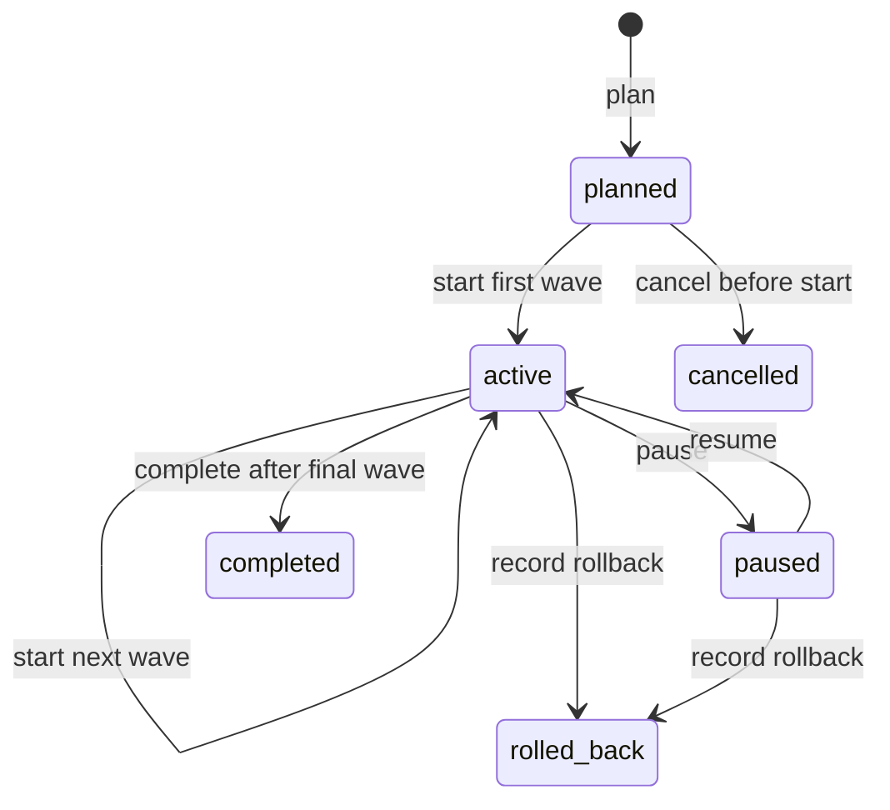

# Cohort rollout control plane

## Purpose

A cohort rollout is an audited plan for introducing one sealed cohort release to a reviewed participant roster in ordered waves. It gives a coach a safe place to plan, pause, resume, complete, cancel, or record a rollback before participant runtime is connected to release activation.

This control plane records operational intent and evidence only. It does not change participant access, invitations, cohort membership, Mia, participant tools, email delivery, or the release used by runtime. Every rollout payload and transition explicitly reports `participant_runtime_changed: false`.

## Stored evidence

- A rollout pins one cohort, coach workspace, target release, planner, role, time, immutable wave plan, and immutable participant roster.
- A wave has a stable position, name, and participant set.
- A transition records the actor, role, event, prior and next state, prior and next wave position, time, and any rollback release.
- Starting, advancing, and completing a wave also store the exact SHA-256 readiness digest reviewed for that decision.
- A `CoachOperationExecution` links each API request to exactly one immutable rollout transition and stores canonical input, before state, predicted state, actual state, request fingerprints, and evidence digests.

Names and user IDs are available to the authorized Studio so coaches can operate the cohort. Immutable snapshots and digests exclude email addresses, messages, household IDs, and financial values.

## Lifecycle

Only one planned, active, or paused rollout may exist for a cohort. A cohort cannot be completed or archived while a rollout remains open. PostgreSQL serializes rollout creation and cohort closure so concurrent requests cannot bypass that rule. A planned rollout may still be cancelled if legacy data already contains a closed cohort with an open plan.

## Readiness

Readiness is evaluated live for each person in the next wave, in this order:

1. `removed` when the person is no longer a participant in the cohort;
2. `revoked` when account access was revoked;
3. `ready` when the invitation was accepted;
4. `awaiting_acceptance` otherwise.

Every current participant must appear in exactly one wave when the plan is created. The next wave can start only when every participant in that wave is ready and the submitted readiness digest still matches. Completion rechecks the final wave, so its evidence never represents an empty participant set. A changed roster, invitation state, access state, release, rollout state, wave position, or transition history causes the caller to reload rather than recording stale evidence.

The database rechecks the exact roster when the planning transaction commits. A roster change that commits before the plan therefore produces the same reload conflict as an earlier change and leaves no partial rollout evidence. A participant change serialized until after the plan commits remains outside that immutable plan and appears in the Studio as outside the rollout.

## Typed operations

The version 1 operations are:

- `cohort.rollout.plan`
- `cohort.rollout.advance`
- `cohort.rollout.pause`
- `cohort.rollout.resume`
- `cohort.rollout.cancel`
- `cohort.rollout.rollback`

The first successful request returns `201`. An exact replay with the same `Idempotency-Key` returns `200` and the original transition. Reusing a key with different normalized input returns `409`. Invalid or incomplete evidence returns `422`; stale state returns `409`; unauthorized actors receive `403`; cross-workspace records resolve as `404`.

The API is available at:

- `GET /api/v1/admin/cohorts/:cohort_id/rollouts`
- `GET /api/v1/admin/cohorts/:cohort_id/rollouts/:id`
- `POST /api/v1/admin/cohorts/:cohort_id/rollouts`
- `POST /api/v1/admin/cohorts/:cohort_id/rollouts/:id/advance`
- `POST /api/v1/admin/cohorts/:cohort_id/rollouts/:id/pause`
- `POST /api/v1/admin/cohorts/:cohort_id/rollouts/:id/resume`
- `POST /api/v1/admin/cohorts/:cohort_id/rollouts/:id/cancel`
- `POST /api/v1/admin/cohorts/:cohort_id/rollouts/:id/rollback`

Workspace owners, reviewers, and platform admins may mutate rollout records. Workspace viewers may inspect the bounded rollout history without mutation controls. The index returns compact rollout summaries plus full details for the open rollout; the detail endpoint returns one rollout's waves, participants, readiness, and transition evidence. History responses report their limit, total count, and whether results were truncated.

Action permissions describe what can succeed from the returned state. Planning is available only when the cohort has participants and its latest sealed release passes immutable integrity and runtime compatibility checks; otherwise the payload includes specific plan blockers. Rollback is available only while a rollout is active or paused and at least one earlier release passes both checks. The detailed rollout returns that exact release as `rollback_candidate`, even when it is older than the bounded release history, plus specific advance and rollback blockers when an action is unavailable. Candidate lookup uses bounded keyset batches rather than materializing the complete release history.

## Database guarantees

- Composite foreign keys keep the rollout, cohort, workspace, releases, waves, participants, transitions, actors, and operation executions in one tenant.
- A partial unique index allows one open rollout per cohort.
- Plan identity, waves, participant roster, and transitions cannot be updated or deleted.
- Database checks cap plans at 25 waves and 500 participants and enforce valid states, positions, actors, readiness digests, rollback shape, and `participant_runtime_changed = false`.
- A serialized database trigger enforces the participant cap under concurrent inserts.
- Lifecycle triggers prevent rollout creation for a closed cohort and prevent cohort closure while a rollout is open.
- Operation-result checks prevent release operation keys from being attached to rollout transitions, and prevent rollout operation keys from being attached to releases.
- Deferred plan checks require the pinned target to remain the cohort's latest sealed release when the transaction commits, so a concurrent release cannot leave false “latest release” evidence.
- A locked append guard serializes transition creation. Deferred checks validate each immutable transition, its exact operation evidence, and the latest rollout state in fixed work rather than replaying an unbounded history on every operation.
- `schema.rb` preserves every custom trigger so a fresh schema load retains the production guarantees.

## Runtime cutover boundary

The later runtime cutover will add an explicit activated-release pointer and participant exposure records. That change must load one release once per request, derive both Mia persona and participant tools from it, preserve release-scoped conversation continuity, and handle participants in multiple cohorts explicitly. Rollout records in this foundation do not activate that behavior.
